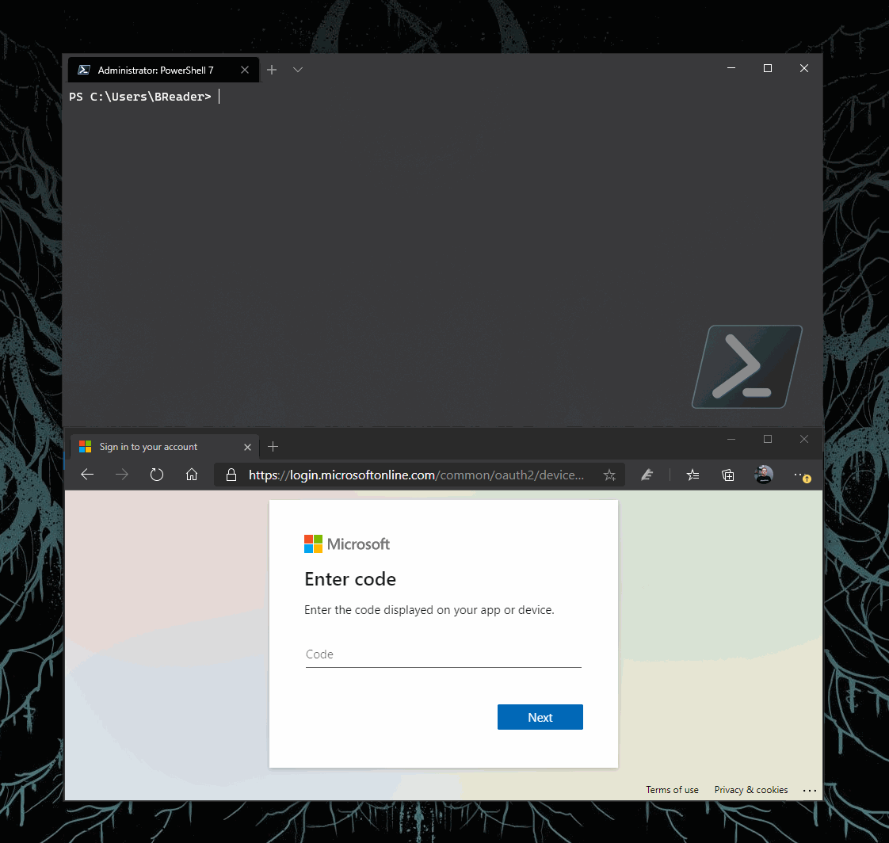

# Intune Configuration Capture & Reporting Solution



## Overview
Solution to extract segments of Intune configuration and provide pretty, formatted tables of configuration data for inclusion in a high level document.

Current endpoints that are captured:
- ADMX (GPO based Configuration Policies)
- AutoPilot
- Device Compliance
- Device Configuration
- Enrollment Status Page
- Scripts
- Win32 Applications

To be finalized:

- Endpoint Security Policies

## Pre-Reqs

The following modules are required for use - once in production these will be automatically installed.

- MSAL.PS
- AzureADPreview
- Newtonsoft.Json

## Usage

Only works with PowerShell 7 - using all the shiny new ternary and null check tools.

The well known Intune AAD Application <code>(d1ddf0e4-d672-4dae-b554-9d5bdfd93547)</code> will request consent using the MASL libraries.

Import the module from this repository (assuming you are already in the root of this directory)

``` PowerShell
Import-Module .\Intune.Reporting
```

There's only one function publically exposed - because I'm nice like that.

``` PowerShell
Build-IntuneConfigReport -Tenant "Powers-Hell.com" -OutputFolder "C:\Path\To\Reports" -Filter admx,autopilot,deviceConfiguration
```

Filter is optional - leave it out and everything that can be reported on will be. Cool!

Raw JSON output from the Intune environment will be sent to the **outputFolder** directory.
A details report will be stored in the root of the **outputFolder** in markdown format - from this you can easily convert to word / pdf from VSCode.

Sample output folder structure shown below.

```
📦powers-hell.com
 ┣ 📂admx
 ┃ ┗ 📂Printers
 ┃ ┃ ┗ 📜_Printers-Point and Print Restrictions.json
 ┣ 📂apps
 ┃ ┣ 📜App1.json
 ┃ ┣ 📜App2.json
 ┃ ┣ 📜App3.json
 ┃ ┣ 📜App4.json
 ┃ ┗ 📜App5.json
 ┣ 📂autopilot
 ┃ ┣ 📜Profile1.json
 ┃ ┗ 📜Profile2.json
 ┣ 📂compliance-policies
 ┃ ┗ 📜Compliance2.json
 ┣ 📂config-profiles
 ┃ ┣ 📜ConfigProfile1.json
 ┃ ┣ 📜ConfigProfile2.json
 ┃ ┗ 📜ConfigProfile3.json
 ┣ 📂endpoint-security-policies
 ┃ ┣ 📂Win10_ATPBaseline
 ┃ ┃ ┣ 📜intent.json
 ┃ ┃ ┗ 📜template.json
 ┃ ┣ 📂Win10_Bitlocker
 ┃ ┃ ┣ 📜intent.json
 ┃ ┃ ┗ 📜template.json
 ┃ ┣ 📂Win10_Firewall
 ┃ ┃ ┣ 📜intent.json
 ┃ ┃ ┗ 📜template.json
 ┃ ┣ 📂Win10_Identity
 ┃ ┃ ┣ 📜intent.json
 ┃ ┃ ┗ 📜template.json
 ┃ ┗ 📂Win10_MSDefenderAV
 ┃ ┃ ┣ 📜intent.json
 ┃ ┃ ┗ 📜template.json
 ┣ 📂esp
 ┃ ┗ 📜All users and all devices.json
 ┣ 📂o365
 ┃ ┗ 📜Office 365 for Windows 10.json
 ┣ 📂scripts
 ┃ ┣ 📂Scrip1
 ┃ ┃ ┣ 📜Script1.json
 ┃ ┃ ┗ 📜Script1.ps1
 ┃ ┣ 📂Scrip2
 ┃ ┃ ┣ 📜Scrip2.json
 ┃ ┃ ┗ 📜Scrip2.ps1
 ┃ ┣ 📂Script3
 ┃ ┃ ┣ 📜Script3.json
 ┃ ┃ ┗ 📜Script3.ps1
 ┃ ┗ 📂Script4
 ┃ ┃ ┣ 📜Script4.json
 ┃ ┃ ┗ 📜Script4.ps1
 ┗ 📜powers-hell.com_report.md
```

Solution requires at minimum Intune administrators role, at most GA - for obvious reasons.
